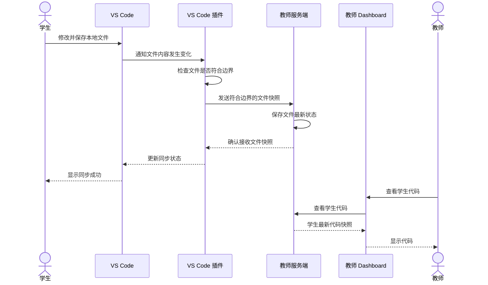

# CodePulse 代码更新时序

## 正常更新流程

```mermaid
sequenceDiagram
    actor student as 学生
    participant vscode as VS Code
    participant extension as VS Code 插件
    participant server as 教师服务端
    participant dashboard as 教师 Dashboard
    actor teacher as 教师

    student->>vscode: 修改并保存本地文件
    vscode->>extension: 通知文件内容发生变化
    extension->>extension: 检查文件是否符合边界
    extension->>server: 发送符合边界的文件快照
    server->>server: 保存文件最新状态
    server-->>extension: 确认接收文件快照
    extension-->>vscode: 更新同步状态
    vscode-->>student: 显示同步成功
    teacher->>dashboard: 查看学生代码
    dashboard->>server: 查看学生代码
    server-->>dashboard: 学生最新代码快照
    dashboard-->>teacher: 显示代码
```