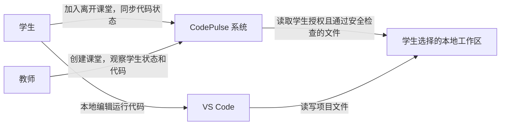

# CodePulse 系统上下文

## 图示

```mermaid
flowchart LR
    student["学生"]
    teacher["教师"]
    vscode["VS Code"]
    workspace["学生选择的本地工作区"]
    codepulse["CodePulse 系统"]

    student -->|"加入离开课堂，同步代码状态"| codepulse
    teacher -->|"创建课堂，观察学生状态和代码"| codepulse
    student -->|"本地编辑运行代码"| vscode
    codepulse -->|"读取学生授权且通过安全检查的文件"| workspace
    vscode -->|"读写项目文件"| workspace
```